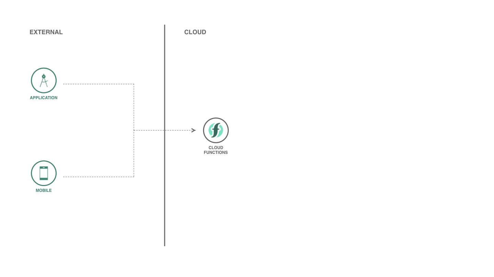

# Serverless DevOps

Setup a Continuous Integration and Continuous Delivery (CI/CD) for your Function using IBM Cloud Continuous Delivery.



## Components and technologies

* [IBM Cloud Functions](https://cloud.ibm.com/functions): IBM Cloud Functions is a Function-as-a-Service (FaaS) platform which executes functions in response to incoming events.
* [IBM Cloud Continuous Delivery](https://cloud.ibm.com/catalog/services/continuous-delivery): Use Continuous Delivery to automate builds, unit tests, deployments, and more. Edit and push code using Git Repos and Issue Tracking and the rich web based IDE. Create toolchains to enable tool integrations that support your development, deployment, and operation tasks.

## Deploy on IBM Cloud

If you're already logged in your IBM Cloud account on IBM Cloud CLI (if you don't, run `ibmcloud login`), run the following command:

```sh
ibmcloud fn deploy --manifest serverless.yml
```

## LICENSE

Copyright 2020 Victor Shinya

Licensed under the Apache License, Version 2.0 (the "License");
you may not use this file except in compliance with the License.
You may obtain a copy of the License at

    http://www.apache.org/licenses/LICENSE-2.0

Unless required by applicable law or agreed to in writing, software
distributed under the License is distributed on an "AS IS" BASIS,
WITHOUT WARRANTIES OR CONDITIONS OF ANY KIND, either express or implied.
See the License for the specific language governing permissions and
limitations under the License.
