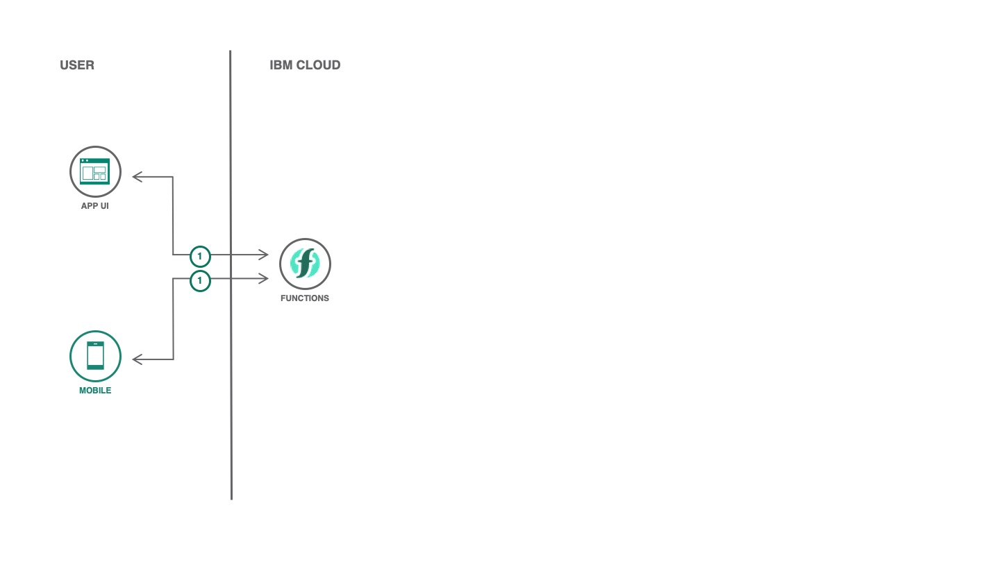

# Serverless DevOps

[](https://cloud.ibm.com)
[](https://developer.ibm.com/technologies/node-js/)
[](https://github.com/victorshinya/serverless-devops/blob/master/LICENSE)
[](https://github.com/victorshinya/serverless-devops/pulls)

Automate your deployments using a CI/CD platform. It can help you increase your throughput and reduce the release cycles. See https://cloud.ibm.com/docs/openwhisk?topic=cloud-functions-deploy for more details.

The [deploy script](deploy_script.sh) is supported by IBM Cloud Continuous Delivery on Cloud Foundry deployer type.



## Components and technologies

* [IBM Cloud Functions](https://cloud.ibm.com/functions): IBM Cloud Functions is a Function-as-a-Service (FaaS) platform which executes functions in response to incoming events.
* [IBM Cloud Continuous Delivery](https://cloud.ibm.com/catalog/services/continuous-delivery): Use Continuous Delivery to automate builds, unit tests, deployments, and more. Edit and push code using Git Repos and Issue Tracking and the rich web based IDE. Create toolchains to enable tool integrations that support your development, deployment, and operation tasks.

## Deployment

To deploy, you need to install [IBM Cloud CLI](https://cloud.ibm.com/docs/cli/reference/ibmcloud/download_cli.html#install_use) and [IBM Cloud Functions CLI](https://cloud.ibm.com/openwhisk/learn/cli) in your local machine. After this step, you need to login in your IBM Cloud account on IBM Cloud CLI (if you haven't already done, run `ibmcloud login`), follow all steps below.

### 1. Clone this repository

```sh
git clone https://github.com/victorshinya/serverless-devops.git
cd serverless-devops
```

### 3. Deploy the function

Run the following command to deploy both `handler.js` function. It requires an account on [IBM Cloud](https://cloud.ibm.com).

> As you are using IBM Cloud Functions, you don't need to install any package or setup a `package.json`. The platform already has the package installed.

```sh
ibmcloud fn deploy --manifest serverless.yml
```

## LICENSE

Copyright 2020 Victor Shinya

Licensed under the Apache License, Version 2.0 (the "License");
you may not use this file except in compliance with the License.
You may obtain a copy of the License at

    http://www.apache.org/licenses/LICENSE-2.0

Unless required by applicable law or agreed to in writing, software
distributed under the License is distributed on an "AS IS" BASIS,
WITHOUT WARRANTIES OR CONDITIONS OF ANY KIND, either express or implied.
See the License for the specific language governing permissions and
limitations under the License.
